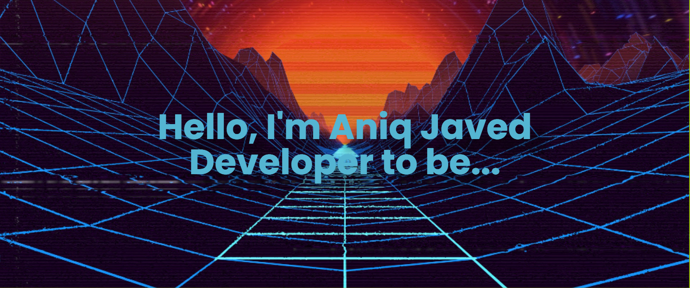

I am a 3rd-year computer science student with  interests in emerging computer technologies. I love to explore and implement these new technologies for the betterment of humanity. Currently, I am working on the MERN stack.

##Technology Stack

<h3 align="left">Languages and Tools:</h3>

   
   
   
   
   
   
   
   

